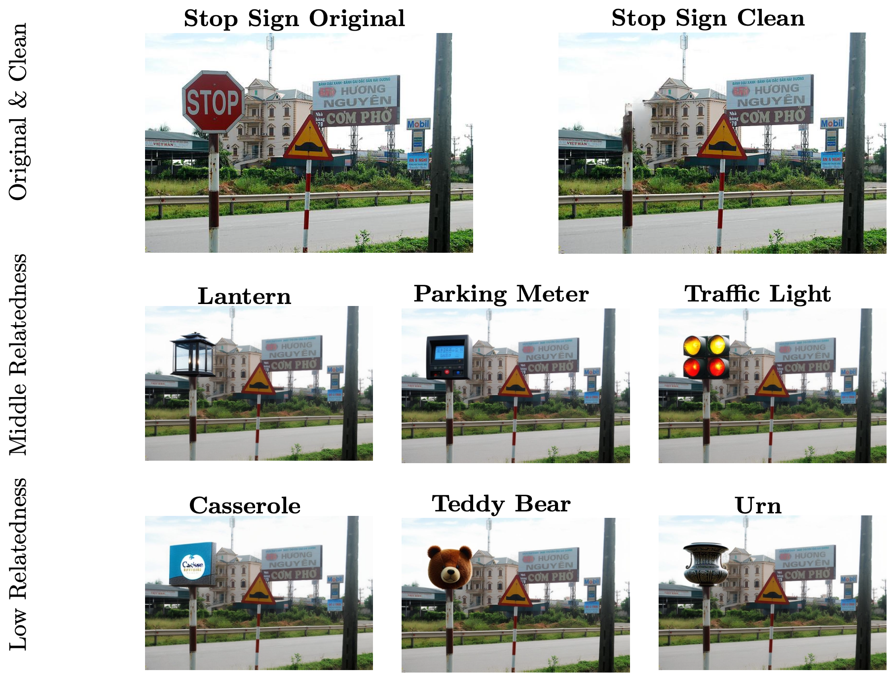

# Cognitive and Human-Inspired Evaluation of Vision-Language Models in Scene Understanding

My thesis project explores the role of contextual cues in vision-language models for referring expression generation, introducing the Common Objects Out-of-Context (COOCO) dataset to evaluate models’ ability to leverage context under varying scene conditions, and analyzing attention patterns to understand scene processing in multimodal models.

